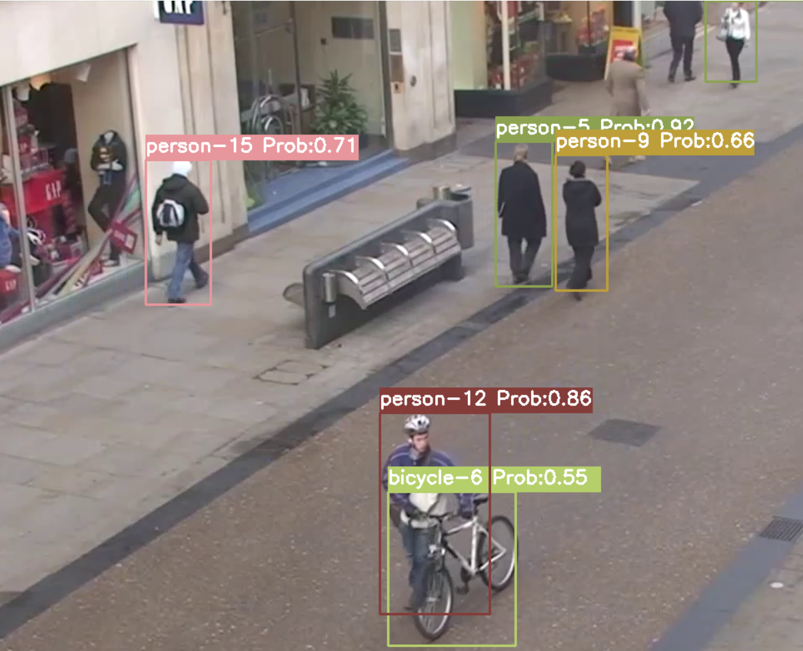

# yolov4-deepsort
Object tracking implemented with YOLOv4, DeepSort, and TensorFlow.
Based on the original project by The AI Guy.
Source: https://github.com/theAIGuysCode/yolov4-deepsort

## Getting Started
Clone repository
```bash
git clone https://github.com/ivantomic17/Object-tracking.git
```
Install dependencies
```bash
# TensorFlow CPU
pip install -r requirements.txt

# TensorFlow GPU
pip install -r requirements-gpu.txt
```

## Downloading Official YOLOv4 Pre-trained Weights
Download pre-trained yolov4-tiny.weights, a smaller model that is faster at running detections but less accurate, download file here: https://github.com/AlexeyAB/darknet/releases/download/darknet_yolo_v4_pre/yolov4-tiny.weights

## Running the Tracker with YOLOv4-Tiny
Make sure that you have downloaded the tiny weights file and added it to the 'data' folder in order for commands to work!
```
# save yolov4-tiny model
python save_model.py --weights ./data/yolov4-tiny.weights --output ./checkpoints/yolov4-tiny-416 --model yolov4 --tiny

# Run yolov4-tiny object tracker
python object_tracker.py --weights ./checkpoints/yolov4-tiny-416 --model yolov4 --video ./data/video/test.mp4 --output ./outputs/tiny.avi --tiny
```

## Building and Running the Web UI
Install Django and Create the Project
```
pip install django
django-admin startproject object_tracking_UI
cd object_tracking_UI
python manage.py startapp tracking
```
Run the Web Server
```
python manage.py runserver
```

## Implemented features
 - Display Classification Probability: Shows the classification probability alongside each object ID.
 - SQL Database Integration: Saves tracking data to an SQL database.
 - Web-Based UI: Provides an interactive interface to visualize object paths for a selected video tracking run and object ID.

## Demo of Object Tracker on Persons with probability
<p align="center"></p>

## Demo of web UI
<p align="center"></p>
<p align="center"></p>